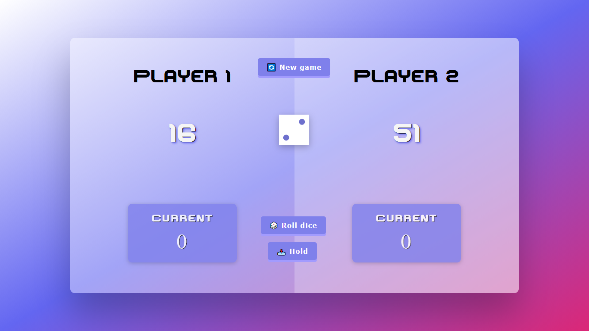
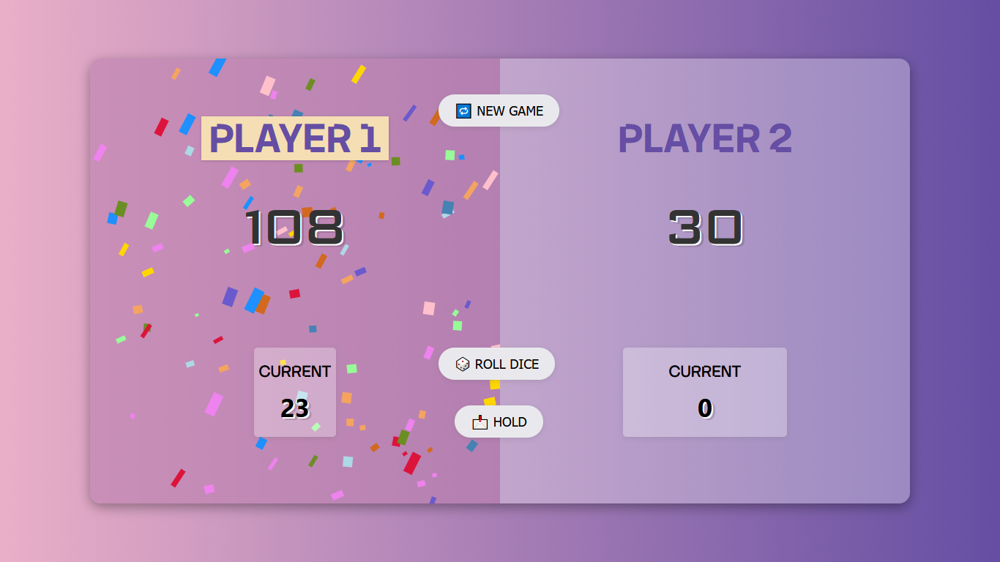

<h1 align="center">🎲 Pig Game (Before ➜ After)</h1>

<p align="center">
  A two-player <b>Pig Dice Game</b> built with <b>HTML, CSS & Vanilla JavaScript</b>.<br/>
  This repo contains both versions: <b>Old (Before)</b> and <b>Improved (After)</b> — showing my progress in UI + clean game logic + state management.
</p>

<p align="center">
  
  
  
  
</p>

---

## 🚀 Live Demo

👉 https://YOUR-USERNAME.github.io/pig-game-v2/

---

## 🎮 Game Rules (Pig Dice)

- Roll the dice 🎲
- If dice is **2–6** → added to **Current score**
- If dice is **1** → you lose current score & turn switches
- Use **Hold** to save Current score to Total score
- First player to reach **100 points** wins 🏆

---

# 🔥 Version 1 — BEFORE (Old)

✅ A basic implementation of the Pig Game used to practice DOM & core JS game logic.

### Features

- Dice roll functionality
- Score update system
- Simple UI
- Restart game

### Limitations

- No winning celebration
- Limited UI feedback
- Less clean game-state handling

### 📸 Preview (Before)

<p align="center">
  
</p>

---

# 🚀 Version 2 — AFTER (Improved)

✅ A refined version with better UI, clean code structure, game-state management and winner celebration.

### ✅ Improvements & Features

- Clean turn-based game logic (player switching)
- Active player highlighting
- Hold score functionality
- Winning condition (100 points)
- Winner UI state
- 🎉 Confetti celebration animation
- Cleaner code & better naming
- Better layout and UI polishing

### 📸 Preview (After)

<p align="center">
  
</p>

---

## 🧠 What I Improved (JavaScript Learnings)

This project helped me learn and apply:

- DOM Manipulation (`querySelector`, `textContent`)
- UI updates using `classList.add/remove/toggle`
- Event handling with `addEventListener()` (Roll / Hold / New Game)
- Game state management using:
  - `activePlayer`
  - `currentScore`
  - `score[]`
  - `isGamePlay`
- Writing cleaner and reusable code with helper functions:
  - `playerChange()`
  - `restartGame()`
- Edge cases handling:
  - Dice = 1 → player switch
  - Stop game after winner
- Using external script for animation (`winner.js`)

---

## 🛠 Tech Stack

- HTML5
- CSS3
- JavaScript (Vanilla)

---

## 📂 Project Structure

```bash
pig-game-v2/
│
├── before/                  # Old version
│   ├── index.html
│   ├── css/
│   └── js/
│
├── after/                   # New improved version
│   ├── index.html
│   ├── css/
│   ├── js/
│   └── images/
│
├── assets/
│   ├── before.png
│   └── after.png
│
└── README.md

